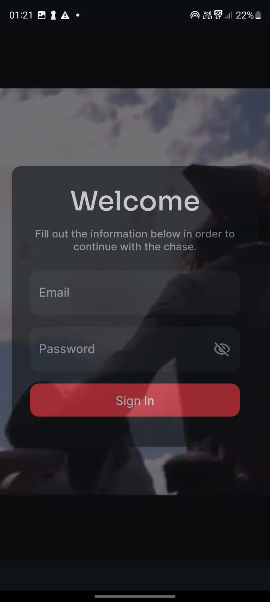

# Code-O-Treasure

Welcome to Code-O-Treasure! An exhilarating treasure hunt experience where participants embark on a thrilling journey to decipher cryptic codes, follow mysterious clues, and unearth hidden treasures.

## About the Game

Code-O-Treasure is a team-based adventure built with Flutter, where participants embark on a thrilling journey to decipher cryptic codes, follow mysterious clues, and unearth hidden treasures. The game features multiple rounds of challenges, each presenting unique puzzles and obstacles to overcome.

## Features

- Engaging gameplay with multiple rounds of challenges.
- Strategic use of keys to unlock hidden advantages.
- Real-time leaderboard to track team progress.
- Immersive audio experience with captivating background music.
- Stunning visuals and graphics to enhance the gaming experience.

## Instructions

To play Code-O-Treasure:

1. Clone this repository to your local machine.
2. Navigate to the project directory in your terminal.
3. Run `flutter pub get` to install the necessary dependencies.
4. Run `flutter run` to launch the game application on your device or simulator.
5. Follow the on-screen instructions to navigate through the rounds.
6. Communicate with your team, strategize, and work together to solve the challenges.
7. Use keys strategically to gain an advantage over your opponents.
8. Reach the final destination and claim victory!

## Screenshots

## Contributions

Contributions are welcome! If you have any suggestions, feature requests, or bug reports, please open an issue or submit a pull request.

## Credits

- Developed by Utkarsh

Replace `[Your Name]` with your actual name or your team's name, and include actual screenshots of your app in the `images` directory, updating the image paths in the README accordingly.
